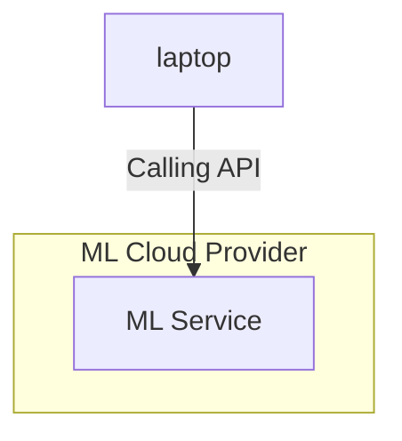
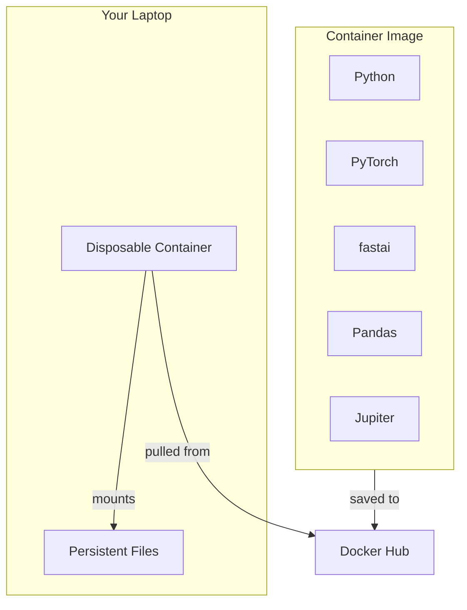
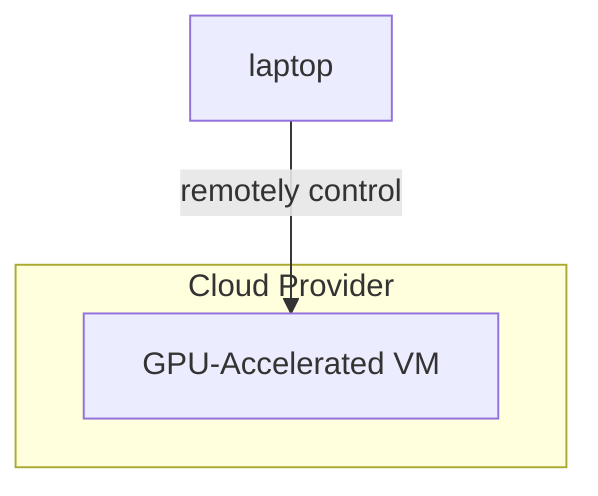

# ai-labs

If you want to run ML tools and their prerequisites/dependencies in your experimentation environment, what would be the shortest path? Here we collected examples of experiments that you can relatively simply execute even without experience in even installing Python.

## Inside an Artificial Neural Network

[lab-contents/001_inside_an_artificial_neural_network](lab-contents/001_inside_an_artificial_neural_network).

## First Machine Learning Experiments

### Ways to Execute ML Training and Inference

First, let's go through some methods of executing the ML processes without preliminary installing prerequisites in your physical environment, like Laptop.

#### Using ML Cloud Providers

Machine learning cloud providers allow you using the most powerful models that might be quite impossible for you to run otherwise.

Examples of LLM models and their requirements:

| LLM Model | VRAM required |
| DeepSeek-R1-Distill-Qwen-1.5B | 1 GB |
| Llama 3.2 3b-instruct-fp16 | 6.4GB |
| Llama 3.3 70b-instruct-fp16 | 160GB |
| Llama 4 Scout | 210 GB |
| Mistral-Large-Instruct-2407 | 250 GB |
| Llama 4 Maverick | 790 GB |
| Llama 3.1 405b | 930GB |
| DeepSeek-R1 | 1500 GB |

Examples of Azure VM sizes that can be used for ML training and inference:

| VM Size | GPU Type | GPU Memory | GPUs | Price per Hour |
| - | - | - | - | - |
| Standard_NC4as_T4_v3 | Nvidia T4 | 16 GB | 1 | $0.6 |
| Standard_NC64as_T4_v3 | Nvidia T4 | 64 GB | 4 | $5 |
| Standard_NC24ads_A100_v4 | Nvidia A100 80GB | 80 GB | 1 | $4.6 |
| Standard_NC40ads_H100_v5 | Nvidia H100 94GB | 94 GB | 1 | $9 |
| Standard_NC48ads_A100_v4 | Nvidia A100 80GB | 160 GB | 2 | $9 |
| Standard_NC80adis_H100_v5 | Nvidia H100 94GB | 188 GB | 2 | $14 |
| Standard_NC96ads_A100_v4 | Nvidia A100 80GB | 320 GB | 4 | $20 |
| Standard_ND96isr_H100_v5 | Nvidia H100 80GB | 640 GB | 8 | $127 |
| Standard_ND96isr_H200_v5 | Nvidia H200 141GB | 1128 GB | 8 | $110 |
| Standard_ND96isr_MI300X_v5 | AMD MI300X 192GB | 1535 GB | 8 | $67 |

#### Using Docker

Use container images that already have such preinstalled software as Python, PyTorch, fastai, Pandas, Jupiter, etc.

Prerequisite for using this approach is Docker installed in Mac, Linux or WSL (Windows) environment.

#### Using Lab VMs

When running on a local docker takes too much resources or too much time, an option might be running the load in the cloud.

Prerequisite for using this approach is having installed tools for remote control of Cloud provider such as Azure.

| Problem Class | Training/Inference     | Environement | ML Toolset                 | Experiment                                         |
| -             | -                      | -            | -                          | -                                                  |
| LLM           | inference              | cloud        | Gemini 1.5                 | [Section](lab-contents/003_llm_cloud_gemini/README.md#trying-llm-google-gemini-15)           |
| LLM           | inference              | cloud        | Gemini 2.0                 | [Section](lab-contents/003_llm_cloud_gemini/README.md#trying-llm-google-gemini-20)           |
| LLM           | prompt with image      | cloud        | Gemini 2.0                 | [Section](lab-contents/003_llm_cloud_gemini/README.md#adding-an-image-to-the-request)        |
| LLM           | inference              | cloud VM     | Llama 4 Scout              | [Page](lab-contents/009_llama_scout_azure_llamastack)        |
| Tabular       | training and inference | docker       | PyTorch, fastai            | [Section](lab-contents/004_tabular_docker_fastai/README.md#fastai-tabular-training-using-cli)     |
| Tabular       | training and inference | docker       | PyTorch, fastai, Jupiter   | [Section](lab-contents/004_tabular_docker_fastai/README.md#fastai-tabular-training-using-jupiter) |
| visual        | training and inference | docker       | PyTorch Lightning, Jupiter | [Page](lab-contents/005_visual_docker_jupyter)     |
| visual        | training and inference | cloud VM     | PyTorch Lightning, Jupiter | [Page](lab-contents/006_visual_azure_jupyter)      |
| visual        | training and inference | cloud VM     | PyTorch Lightning, CLI | [Page](lab-contents/007_visual_azure_cli)      |
| visual        | training and inference | Macbook      | PyTorch Lightning, Jupiter | [Page](lab-contents/008_visual_macbook_jupyter)      |
