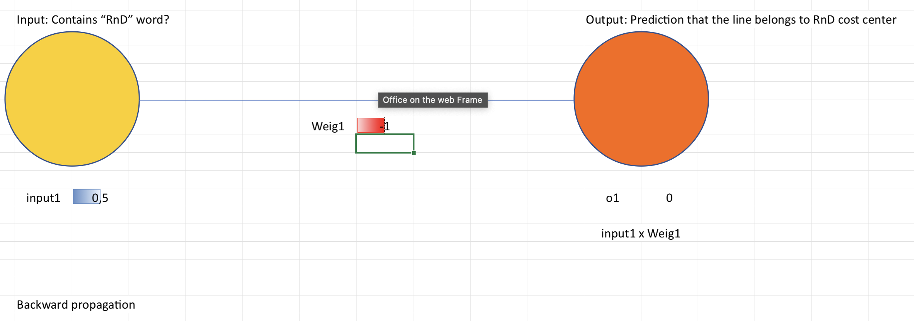

# Inside an Artificial Neural Network

## Goals

### Understand main terms of machine learning

  - model
  - unit
  - weight
  - inference
  - learning
  - dataset

## Walkthrough

### Simplest Model

1. Download [the Simplest Network Basic Model.xlsx](https://github.com/downloads/shurick81/ai-labs/lab-contents/001_inside_an_artificial_neural_network/Neural%20Network%20Basic%20Model.xlsx)

