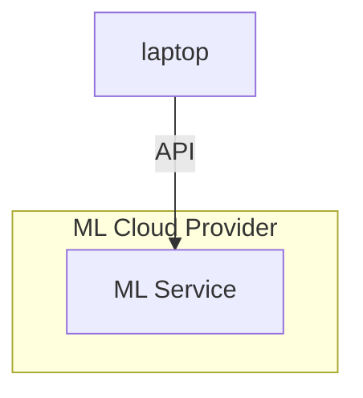

# First Machine Learning Experiments

If you want to run ML tools and their prerequisites/dependencies in your experimentation environment, what would be the shortest path? Here we collected examples of experiments that you can relatively simply execute even without experience in even installing Python.

## Ways to Execute ML Training and Inference

First, let's go through some methods of executing the ML processes without preliminary installing prerequisites in your physical environment, like Laptop.

### Using Docker

Use container images that already have such preinstalled software as Python, PyTorch, fastai, Pandas, Jupiter, etc.


Prerequisite for using this approach is Docker installed in Mac, Linux or WSL (Windows) environment.

### Using Lab VMs

When running on a local docker takes too much resources or too much time, an option might be running the load in the cloud.


Prerequisite for using this approach is having installed tools for remote control of Cloud provider such as Azure.

### Using ML Cloud Provider

Machine learning cloud providers allow you using the most powerful models that might be quite impossible for you to run otherwise.



## Hands-on Labs

| Problem Class | Training/Inference | Environement | ML Toolset | Experiment |
| - | - | - | - | - |
| Tabular | training and inference | docker | Pytorch, fastai | [Section](#fastai-tabular-training-using-cli) |
| Tabular | training and inference | docker | Pytorch, fastai, Jupiter | [Section](#fastai-tabular-training-using-jupiter) |
| LLM | inference | cloud | Gemini 1.5 | [Section](#trying-llm-gemini-1.5) |

### fastai Tabular Training Using CLI

1. Using Docker on Linux, WSL or Mac, run

```bash
docker run --rm -it -v $PWD:/usr/src fastai/fastai:2021-02-11 /bin/bash -c python
```

2. In the container, execute the following Pytnon commands:

```Python
# Training
from fastai.tabular.all import *
train_data = [[0,0,0,0],
              [0,1,0,1],
              [1,0,0,1],
              [1,1,0,0],
              [0,0,1,0],
              [0,1,1,1],
              [1,0,1,1],
              [1,1,1,0]]
df = pd.DataFrame(train_data, columns=['input0', 'input1', 'input2', 'output0'])
df.head()
splits = RandomSplitter()(range_of(df))
y_block = CategoryBlock()
to = TabularPandas(df, procs=[FillMissing, Categorify, Normalize], cat_names = ['input0', 'input1', 'input2'], y_names='output0', splits=splits)
dls = to.dataloaders(bs=2)
dls.show_batch()
learn = tabular_learner(dls, metrics=accuracy)
learn.fit_one_cycle(200)

# Trying the trained model
test_df = pd.DataFrame([[0,1,0]], columns=['input0', 'input1', 'input2'])
dl = learn.dls.test_dl(test_df)
learn.get_preds(dl=dl)
# Expected output/prediction: closer to 1

test_df = pd.DataFrame([[1,0,0]], columns=['input0', 'input1', 'input2'])
dl = learn.dls.test_dl(test_df)
learn.get_preds(dl=dl)
# Expected output/prediction: closer to 1

test_df = pd.DataFrame([[1,1,1]], columns=['input0', 'input1', 'input2'])
dl = learn.dls.test_dl(test_df)
learn.get_preds(dl=dl)
# Expected output/prediction: closer to 0

# Exporting the model/parameters to a file
learn.export('/usr/src/zeros-ones-00.pkl')
```

3. Ctrl + D to exit the container.

4. Verify that the new file, `zeros-ones-00.pkl`, is created

```bash
ls -lh
```

Check the size of the `zeros-ones-00.pkl` file.

5. Create a new container again

```bash
docker run --rm -it -v $PWD:/usr/src fastai/fastai:2021-02-11 /bin/bash -c python
```

6. Run the following Python code

```python
# Load the model that was saved on previous steps
from fastai.tabular.all import *
learn = load_learner('/usr/src/zeros-ones-00.pkl')

# Trying the trained model
test_df = pd.DataFrame([[0,1,0]], columns=['input0', 'input1', 'input2'])
dl = learn.dls.test_dl(test_df)
learn.get_preds(dl=dl)
# Expected output/prediction: closer to 1

test_df = pd.DataFrame([[1,0,0]], columns=['input0', 'input1', 'input2'])
dl = learn.dls.test_dl(test_df)
learn.get_preds(dl=dl)
# Expected output/prediction: closer to 1

test_df = pd.DataFrame([[1,1,1]], columns=['input0', 'input1', 'input2'])
dl = learn.dls.test_dl(test_df)
learn.get_preds(dl=dl)
# Expected output/prediction: closer to 0
```

7. Follow more tutorials from https://docs.fast.ai/tutorial.tabular.html

### fastai Tabular Training Using Jupiter

1. Using Docker on Linux, WSL or Mac, execute fastai container with Jupiter server:

```bash
docker run --rm -p 8888:8888 fastai/fastai:2021-02-11 /bin/bash -c "\
  mkdir -p /opt/notebooks && \
  jupyter notebook \
    --notebook-dir=/opt/notebooks --ip='*' --port=8888 \
    --no-browser --allow-root"
```

2. Follow one of the tutorials. For example, https://docs.fast.ai/tutorial.tabular.html

### Trying LLM Google Gemini 1.5

```bash
GOOGLE_API_KEY=<set-key-value>;
curl "https://generativelanguage.googleapis.com/v1beta/models/gemini-1.5-flash:generateContent?key=$GOOGLE_API_KEY" \
-H 'Content-Type: application/json' \
-X POST \
-d '{
  "contents": [{
    "parts":[{"text": "What time is it now?"}]
    }]
   }'
```

### Trying LLM Google Gemini 2.0

```bash
GOOGLE_API_KEY=<set-key-value>;
curl "https://generativelanguage.googleapis.com/v1beta/models/gemini-2.0-flash:generateContent?key=$GOOGLE_API_KEY" \
-H 'Content-Type: application/json' \
-X POST \
-d '{
  "contents": [{
    "parts":[{"text": "What time is it now in Stockholm?"}]
    }]
   }'
```

### Adding an image to the request


```bash
# Downloading a sample image
curl -o me.jpg "https://github.com/downloads/shurick81/ai-labs/lab-contents/002_first_machine_learning_experiments/me.jpg"

# Preparing the prompt
echo '{
  "contents":[
    {
      "parts":[
        {"text": "This image contains an image of a man. Describe the picture in a positive way and what makes the man so handsome \
        {description: description, : [property1, property2, property3, etc]}"},
        {
          "inline_data": {
            "mime_type":"image/jpeg",
            "data": "'$(base64 -i me.jpg)'"
          }
        }
      ]
    }
  ]
}' > request.json

# Requesting
curl "https://generativelanguage.googleapis.com/v1beta/models/gemini-2.0-flash:generateContent?key=$GOOGLE_API_KEY" \
        -H 'Content-Type: application/json' \
        -d @request.json
```

## Ideas for the future

Here's ideas what we could add to the labs in the future:

- Recognition
  - image
    - face
  - text/OCR
  - audio
  - video
- generative
  - LLM
  - music
  - voice
  - pictures
  - video

Don't hesitate to give feedback in form of PRs, Github issues.
