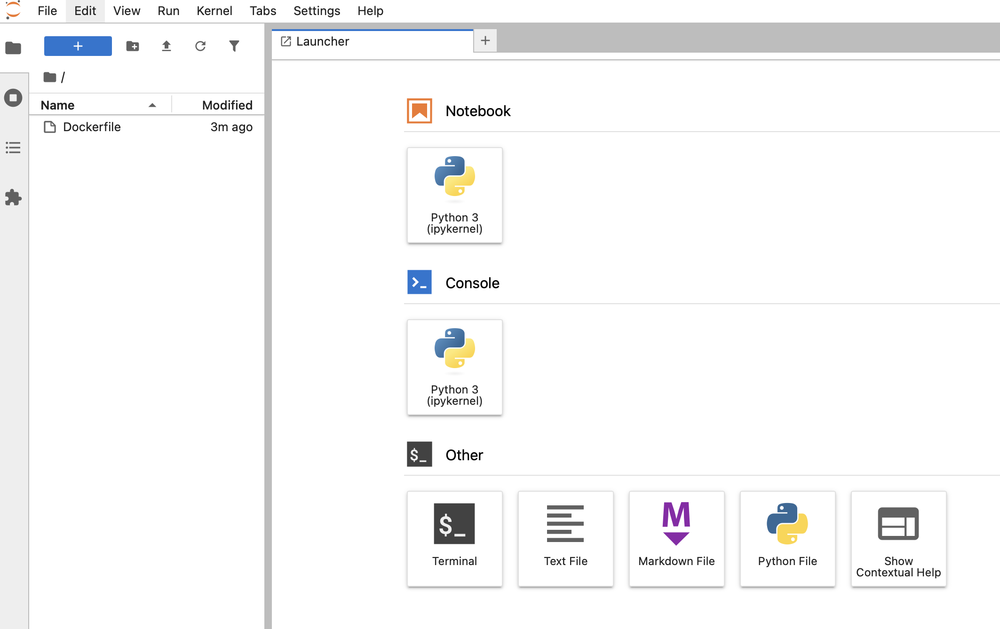
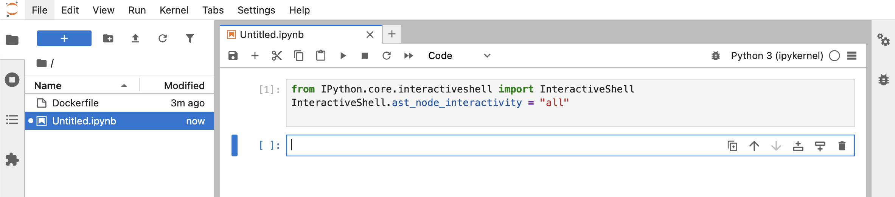
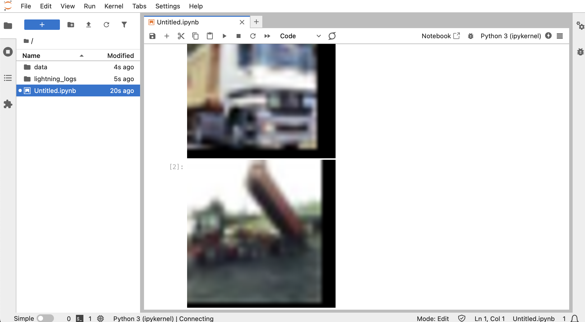
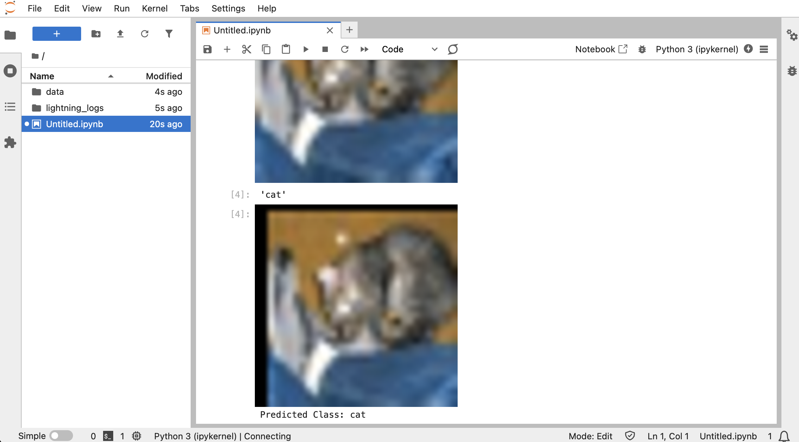

# Image recognition using a Cloud VM

When a task is too resource consuming for running on your laptop, you can hire a VM in the cloud. There might be a few options.

## Using Azure Cloud Shell

In Azure there are a few VM sizes you can choose from when working with ML:

- Standard_NC6s_v3, Nvidia Tesla V100 GPU (16GB), minumum VRAM is 16, default quota is 0
- Standard_NC4as_T4_v3, Nvidia Tesla T4 GPU (16GB), minumum VRAM is 16, default quota is 0
- Standard_ND6s, Nvidia Tesla P40 GPU (24GB), minimum VRAM is 24, default quota is 0
- Standard_NG8ads_V620_v1, AMD Radeon PRO V620 GPU (32GB), 8-32 GB VRAM, default quota (StandardNGADSV620v1Family) is 0
- Standard_NV12s_v3, Nvidia Tesla M60 GPU (16GB), 8-32 GB VRAM, default quota (standardNVSv3Family) is 0
- Standard_NV4as_v4, AMD Instinct MI25 GPU (16GB), minimum VRAM is 2, by default quota is 8, only supporting Windows
- Standard_NV4ads_V710_v5, AMD Radeon™ Pro V710, minimum VRAM is 4, default quota (StandardNVadsV710v5Family) is 0
- Standard_NV6ads_A10_v5, Nvidia A10 GPU (24GB), minimum VRAM is 2, by default quota is 0
- Standard_NC24ads_A100_v4, Nvidia PCIe A100 GPU (80GB), minimum VRAM is 80, 
- Standard_ND96isr_H200_v5, Nvidia H200 GPU (141GB), 1128 GB VRAM, default quota (standardNDISRH200V5Family) is 0
- Standard_ND96isr_MI300X_v5, AMD Instinct MI300X GPU (192GB), 1535 GB VRAM, default quota is 0

https://learn.microsoft.com/en-us/azure/virtual-machines/sizes/overview?tabs=breakdownseries%2Cgeneralsizelist%2Ccomputesizelist%2Cmemorysizelist%2Cstoragesizelist%2Cgpusizelist%2Cfpgasizelist%2Chpcsizelist#gpu-accelerated

### Nvidia

Before starting, make sure that in your Azure subscription you have at least 64 Cores quota available for `Standard NCASv3_T4 Family vCPUs` (`standardNCASv3_T4Family`). This itself can take awhile.

```bash
# Create ~/.ssh directory if it does not exist
mkdir -p ~/.ssh

# Create an SSH key pair
ssh-keygen -m PEM -t rsa -b 4096 -f ~/.ssh/id_rsa.pem
cat ~/.ssh/id_rsa.pem.pub

az group create --name ai-labs-00 --location westus3
az vm delete \
  --resource-group ai-labs-00 \
  --name small_nvidia \
  -y;
start_time=$(date +%s.%N)  # Capture start time
az vm create \
  --resource-group ai-labs-00 \
  --name small_nvidia \
  --image Microsoft-DSVM:Ubuntu-HPC:2204:22.04.2024102301 \
  --size Standard_NC4as_T4_v3 \
  --security-type Standard \
  --os-disk-size-gb 256 \
  --os-disk-delete-option Delete \
  --admin-username admin98475897 \
  --ssh-key-values ~/.ssh/id_rsa.pem.pub;
end_time=$(date +%s.%N)  # Capture end time
elapsed_time=$(awk "BEGIN {print $end_time - $start_time}")
echo "Elapsed time: $elapsed_time seconds"
# 65-85 sec

vm_ip_address=$(az vm list-ip-addresses --resource-group ai-labs-00 --name small_nvidia --query [].virtualMachine.network.publicIpAddresses[].ipAddress -o tsv);
ssh-keygen -R $vm_ip_address;
az ssh vm --resource-group ai-labs-00 --name small_nvidia --local-user admin98475897 --private-key-file ~/.ssh/id_rsa.pem "echo test";
```

confirm `yes`
then run

```bash
start_time=$(date +%s.%N)  # Capture start time
az ssh vm --resource-group ai-labs-00 --name small_nvidia --local-user admin98475897 --private-key-file ~/.ssh/id_rsa.pem "sudo usermod -aG docker admin98475897";
az ssh vm --resource-group ai-labs-00 --name small_nvidia --local-user admin98475897 --private-key-file ~/.ssh/id_rsa.pem docker pull nvcr.io/nvidia/pytorch:25.02-py3;
az ssh vm --resource-group ai-labs-00 --name small_nvidia --local-user admin98475897 --private-key-file ~/.ssh/id_rsa.pem "docker run --rm --gpus all nvcr.io/nvidia/k8s/cuda-sample:nbody nbody -benchmark";
end_time=$(date +%s.%N)  # Capture end time
elapsed_time=$(awk "BEGIN {print $end_time - $start_time}")
echo "Elapsed time: $elapsed_time seconds"
# 770-775 sec
```

expected output:

```
> Compute 7.5 CUDA device: [Tesla T4]
40960 bodies, total time for 10 iterations: 106.236 ms
= 157.924 billion interactions per second
= 3158.482 single-precision GFLOP/s at 20 flops per interaction
```

taking image and deleting the VM:

```bash
start_time=$(date +%s.%N)  # Capture start time
az ssh vm --resource-group ai-labs-00 --name small_nvidia --local-user admin98475897 --private-key-file ~/.ssh/id_rsa.pem "sudo waagent -deprovision+user -force";
az vm deallocate --resource-group ai-labs-00 --name small_nvidia;
az vm generalize --resource-group ai-labs-00 --name small_nvidia;
az image create \
  --resource-group ai-labs-00 \
  --name small_nvidia_00 \
  --source small_nvidia \
  --os-type Linux \
  --hyper-v-generation V2;
az vm delete \
  --resource-group ai-labs-00 \
  --name small_nvidia \
  -y;
end_time=$(date +%s.%N)  # Capture end time
elapsed_time=$(awk "BEGIN {print $end_time - $start_time}")
echo "Elapsed time: $elapsed_time seconds"
# 100-105 sec
```

```bash
start_time=$(date +%s.%N)  # Capture start time
image_id=$(az resource show --resource-group ai-labs-00 --name small_nvidia_00 --resource-type Microsoft.Compute/images --query id -o tsv);
az vm create \
  --resource-group ai-labs-00 \
  --name small_nvidia \
  --image $image_id \
  --size Standard_NC4as_T4_v3 \
  --security-type Standard \
  --os-disk-size-gb 256 \
  --os-disk-delete-option Delete \
  --admin-username admin98475897 \
  --ssh-key-values ~/.ssh/id_rsa.pem.pub;
end_time=$(date +%s.%N)  # Capture end time
elapsed_time=$(awk "BEGIN {print $end_time - $start_time}")
echo "Elapsed time: $elapsed_time seconds"
# 65-70 sec
vm_ip_address=$(az vm list-ip-addresses --resource-group ai-labs-00 --name small_nvidia --query [].virtualMachine.network.publicIpAddresses[].ipAddress -o tsv);
ssh-keygen -R $vm_ip_address;
az ssh vm --resource-group ai-labs-00 --name small_nvidia --local-user admin98475897 --private-key-file ~/.ssh/id_rsa.pem "sudo usermod -aG docker admin98475897";
```

confirm `yes`
then run

```bash
start_time=$(date +%s.%N)  # Capture start time
az ssh vm --resource-group ai-labs-00 --name small_nvidia --local-user admin98475897 --private-key-file ~/.ssh/id_rsa.pem "
cat <<EOF | sudo tee Dockerfile
FROM nvcr.io/nvidia/pytorch:25.02-py3
RUN pip install lightning==2.5.0
RUN pip install lightning[extra]
EOF
docker buildx build --platform=linux/amd64 --progress=plain --no-cache . -t nvcr.io-nvidia-pytorch-25.02-py3-lightning-2.5.0"
end_time=$(date +%s.%N)  # Capture end time
elapsed_time=$(awk "BEGIN {print $end_time - $start_time}")
echo "Elapsed time: $elapsed_time seconds"
# 140-150 sec

start_time=$(date +%s.%N)  # Capture start time
az ssh vm --resource-group ai-labs-00 --name small_nvidia --local-user admin98475897 --private-key-file ~/.ssh/id_rsa.pem "sudo waagent -deprovision+user -force";
az vm deallocate --resource-group ai-labs-00 --name small_nvidia;
az vm generalize --resource-group ai-labs-00 --name small_nvidia;
az image create \
  --resource-group ai-labs-00 \
  --name small_nvidia_01 \
  --source small_nvidia \
  --os-type Linux \
  --hyper-v-generation V2;
az vm delete \
  --resource-group ai-labs-00 \
  --name small_nvidia \
  -y;
end_time=$(date +%s.%N)  # Capture end time
elapsed_time=$(awk "BEGIN {print $end_time - $start_time}")
echo "Elapsed time: $elapsed_time seconds"
# 100-140 sec
```

```bash
start_time=$(date +%s.%N)  # Capture start time
image_id=$(az resource show --resource-group ai-labs-00 --name small_nvidia_01 --resource-type Microsoft.Compute/images --query id -o tsv);
az vm create \
  --resource-group ai-labs-00 \
  --name small_nvidia \
  --image $image_id \
  --size Standard_NC64as_T4_v3 \
  --security-type Standard \
  --os-disk-size-gb 256 \
  --os-disk-delete-option Delete \
  --admin-username admin98475897 \
  --ssh-key-values ~/.ssh/id_rsa.pem.pub;
az network nsg rule create \
  --resource-group ai-labs-00 \
  --nsg-name small_nvidiaNSG \
  --name AllowJupyterServer \
  --protocol tcp \
  --priority 1001 \
  --destination-port-range 8888 \
  --access allow
end_time=$(date +%s.%N)  # Capture end time
elapsed_time=$(awk "BEGIN {print $end_time - $start_time}")
echo "Elapsed time: $elapsed_time seconds"
# 65-80 sec
vm_ip_address=$(az vm list-ip-addresses --resource-group ai-labs-00 --name small_nvidia --query [].virtualMachine.network.publicIpAddresses[].ipAddress -o tsv);
ssh-keygen -R $vm_ip_address;
az ssh vm --resource-group ai-labs-00 --name small_nvidia --local-user admin98475897 --private-key-file ~/.ssh/id_rsa.pem "sudo usermod -aG docker admin98475897";
```

confirm `yes`
then run

```bash
az ssh vm --resource-group ai-labs-00 --name small_nvidia --local-user admin98475897 --private-key-file ~/.ssh/id_rsa.pem 'docker run --rm -v $PWD:/usr/src -p 8888:8888 --gpus all --ipc=host --ulimit memlock=-1 --ulimit stack=67108864 nvcr.io-nvidia-pytorch-25.02-py3-lightning-2.5.0 /bin/bash -c "jupyter lab --allow-root --notebook-dir=/usr/src"'
```

copy paste the URL from the output of the previous command, for example: http://hostname:8888/?token=305b042aa2ab27151903ebb644598bd20aedc8dedce8f1a1, to the browser and replace the `hostname` with IP address. It would look like this:

http://4.211.83.160:8888/?token=305b042aa2ab27151903ebb644598bd20aedc8dedce8f1a1




In the Notebook section click on the Python 3 tile. You should see something like this:


Run further Python code in the Jupyter lab.

## Prepare data for training

First, configure the session to show entire output from the Jupyter cells, instead of showing only output of the last line:

```py
from IPython.core.interactiveshell import InteractiveShell
InteractiveShell.ast_node_interactivity = "all"
```

Copy paste the code above to the first notebook cell and then click `Shift` + `Enter` for executing it:



Next, you can run the first piece of the code that loads and shows some examples from the training datasets and also shows images after pre-processing:

```py
import torch
import torch.nn as nn
import torch.nn.functional as F
from torch.utils.data import DataLoader
from torchvision import datasets, transforms
from torchvision.transforms import ToPILImage
from PIL import Image
import pytorch_lightning as pl
from pytorch_lightning import Trainer
from torchmetrics.classification import Accuracy

# Step 1: Dataset Exploration

# load dataset
sample_data = datasets.CIFAR10(root="data", train=True, download=True)
# show image classes
sample_data.classes
# first image
sample_data[0][0].resize([300, 300])
# first image class
sample_data.classes[sample_data[0][1]]
# second image
sample_data[1][0].resize([300, 300])
# second image class
sample_data.classes[sample_data[1][1]]
# third image
sample_data[2][0].resize([300, 300])
# third image class
sample_data.classes[sample_data[2][1]]

# Step 2: Dataset Preparation
transform_train = transforms.Compose([
    transforms.RandomCrop(32, padding=4),
    transforms.RandomHorizontalFlip(),
    transforms.ToTensor()
])
# Download and load CIFAR-10 dataset
train_data = datasets.CIFAR10(root="data", train=True, download=True, transform=transform_train)
# Show some images
to_img = ToPILImage()
#first image RGB tensor after transformation
train_data[0][0]
#first image after transformation
to_img(train_data[0][0]).resize([300, 300])
#second image after transformation
to_img(train_data[1][0]).resize([300, 300])
#third image after transformation
to_img(train_data[2][0]).resize([300, 300])
```

You should be able to see some samples of the training pictures before and after preprocessing:



In this lab we are using CIFAR 10 training set with 50000 training 32x32 images, each associated with one of ten classes.

## Train the model

Next step is to do the training:

```py
train_loader = DataLoader(train_data, batch_size=16, shuffle=True, num_workers=4, persistent_workers=True)

# Step 3: Define the Image Classification Model
class ImageClassifier(pl.LightningModule):
    def __init__(self):
        super(ImageClassifier, self).__init__()
        self.conv1 = nn.Conv2d(3, 32, kernel_size=3, stride=1)
        self.conv2 = nn.Conv2d(32, 64, 3, 1)
        self.fc1 = nn.Linear(64 * 6 * 6, 128)
        self.fc2 = nn.Linear(128, 10)
        self.test_accuracy = Accuracy(task="multiclass", num_classes=10)
    
    def forward(self, x):
        x = F.relu(self.conv1(x))
        x = F.max_pool2d(x, 2)
        x = F.relu(self.conv2(x))
        x = F.max_pool2d(x, 2)
        x = x.view(-1, 64 * 6 * 6)
        x = F.relu(self.fc1(x))
        x = self.fc2(x)
        return F.log_softmax(x, dim=1)

    def training_step(self, batch, batch_idx):
        inputs, labels = batch
        outputs = self(inputs)
        loss = F.nll_loss(outputs, labels)
        self.log('train_loss', loss, sync_dist=True)
        return loss

    def test_step(self, batch, batch_idx):
        inputs, labels = batch
        outputs = self(inputs)
        test_loss = F.nll_loss(outputs, labels)
        acc = self.test_accuracy(outputs, labels)  # <- Accuracy here
        self.log('test_loss', test_loss, sync_dist=True)
        self.log('test_accuracy', acc, sync_dist=True)
        return {'loss': test_loss, 'accuracy': acc}

    def configure_optimizers(self):
        optimizer = torch.optim.Adam(self.parameters(), lr=0.001)
        scheduler = torch.optim.lr_scheduler.StepLR(optimizer, step_size=5, gamma=0.5)
        return [optimizer], [scheduler]

# Initialize the model
model = ImageClassifier()

# Create a Trainer object
trainer = Trainer(max_epochs=25, devices=4, accelerator="gpu")
# Train the model
trainer.fit(model, train_loader)
```

## Try it out

Now when the model got some training, we can test it out!

```py
# Looking at the non-seen data (train=False)
sample_data = datasets.CIFAR10(root="data", train=False, download=True)

transform_test = transforms.Compose([
    transforms.RandomCrop(32, padding=4),
    transforms.RandomHorizontalFlip(),
    transforms.ToTensor()
])

val_data = datasets.CIFAR10(root="data", train=False, download=True, transform=transform_test)
val_loader = DataLoader(val_data, batch_size=16, shuffle=False, num_workers=4)

# first image
sample_data[0][0].resize([300, 300])
# first image class
sample_data.classes[sample_data[0][1]]

# first transformed image
to_img(val_data[0][0]).resize([300, 300])

with torch.no_grad():
    logits = model(val_data[0][0].unsqueeze(0))
    predicted_class = logits.argmax(dim=1).item()

print("Predicted Class:", train_data.classes[predicted_class])
```



## Evaluation

Does the classification work? Let's measure!

```py
trainer.test(model, val_loader)
```

Test loss between 0.8 and 0.9 and accuracy between 0.65 and 0.75 might be expected.

Test loss around 2.3 for the prediction among 10 classes would mean that the model is answering randomly, it is not trained at all. Accuracy would be around 0.1 in this case so in average the model would guess the correct class in 10% of the queries.

For improving results, run training in many iterations:

```py
trainer = Trainer(max_epochs=100, devices=4, accelerator="gpu")
trainer.fit(model, train_loader)
trainer.test(model, val_loader)
```

What does the test loss look now?

Since training can be time consuming, perhaps you would like to save the results, the weights of the model after training so you can continue using them even after shutting down the container. Use the following commands for saving files to the VM disk:

```py
# Save the model
trainer.save_checkpoint("cifar10_model00.ckpt")

# Load the model
model = ImageClassifier.load_from_checkpoint("cifar10_model00.ckpt")
```

These are bash commands for copying between the Azure Cloud Shell and the VM:

```bash
# list files in the current directory
az ssh vm --resource-group ai-labs-00 --name small_nvidia --local-user admin98475897 --private-key-file ~/.ssh/id_rsa.pem "ls /home/admin98475897"
```

```bash
# copy the checkpoint file from the VM to Azure Cloud Shell
vm_ip_address=$(az vm list-ip-addresses --resource-group ai-labs-00 --name small_nvidia --query [].virtualMachine.network.publicIpAddresses[].ipAddress -o tsv);
az ssh vm --resource-group ai-labs-00 --name small_nvidia --local-user admin98475897 --private-key-file ~/.ssh/id_rsa.pem "sudo chown admin98475897:admin98475897 /home/admin98475897/cifar10_model00.ckpt"
scp -i ~/.ssh/id_rsa.pem admin98475897@$vm_ip_address:/home/admin98475897/cifar10_model00.ckpt .
```

```bash
# Back from the Azure Cloud Shell to the VM:
vm_ip_address=$(az vm list-ip-addresses --resource-group ai-labs-00 --name small_nvidia --query [].virtualMachine.network.publicIpAddresses[].ipAddress -o tsv);
scp -i ~/.ssh/id_rsa.pem cifar10_model00.ckpt admin98475897@$vm_ip_address:/home/admin98475897/
```

Treating the VM as a disposable compute resource, delete it as soon as you don't need compute power, so it does not cost you more than necessary:

```bash
az vm delete \
  --resource-group ai-labs-00 \
  --name small_nvidia \
  -y;
```

In some cases, when you have files that only saved on the VM, you might want to stop it without deleting:

```bash
az vm deallocate \
  --resource-group ai-labs-00 \
  --name small_nvidia;
```

Here's some example of the time that it takes to train a model:

- Hardware: T4
- Epochs: 25
- Time taken: 141 sec
- Prediction Accuracy: 0.7
- Test Loss: 0.88
