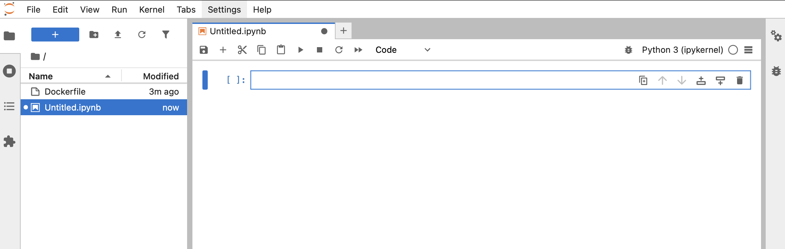
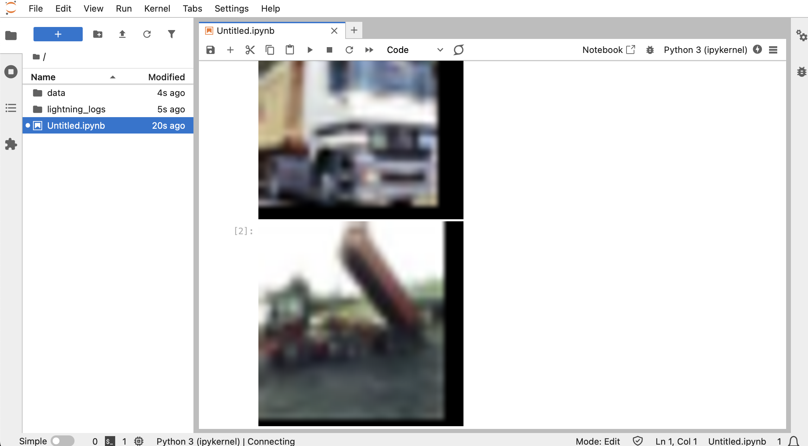
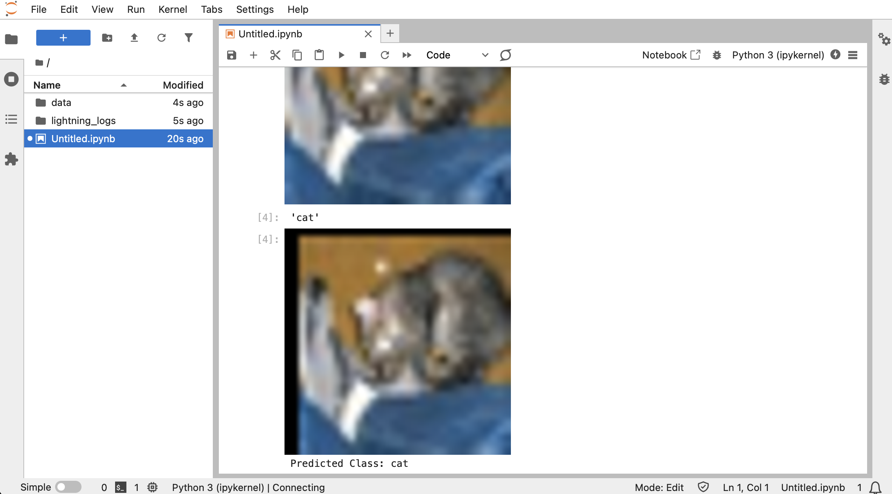

# Image recognition using Macbook

## Prerequsites

### Option #1, using conda

```sh
curl -O https://repo.anaconda.com/miniconda/Miniconda3-py312_25.1.1-2-MacOSX-arm64.sh
sh Miniconda3-py312_25.1.1-2-MacOSX-arm64.sh
```

rerun terminal, then run

```sh
conda install python=3.12.9 pytorch::pytorch=2.5.1 pytorch::torchvision=0.20.1
conda install conda-forge::pytorch-lightning=2.5.1
conda install jupyterlab=4.3.4
```

### Option #2, using brew and pip

```sh
#Install brew if you have not installed it yet
/bin/bash -c "$(curl -fsSL https://raw.githubusercontent.com/Homebrew/install/HEAD/install.sh)"
cd /opt/homebrew/bin/
ls
PATH=$PATH:/opt/homebrew/bin
cd
touch .zshrc
echo export PATH=$PATH:/opt/homebrew/bin -> .zshrc

#Install remaining prereqs:
brew install python@3.12

pip3 install torch==2.6.0
pip3 install torchvision==0.21.0
pip3 install lightning==2.5.0
pip3 install "lightning[extra]"
pip3 install jupyterlab==4.3.6
export PATH="$HOME/Library/Python/3.9/bin:$PATH"
```

## Run

```sh
python3
```

```py
import torch
if torch.backends.mps.is_available():
    mps_device = torch.device("mps")
    x = torch.ones(1, device=mps_device)
    print (x)
else:
    print ("MPS device not found.")
```

`Ctrl` + `D`

```sh
jupyter lab
```

You should expect to see the following page:


In the Notebook section click on the Python 3 tile. You should see something like this:



Run further Python code in the Jupyter lab.

## Prepare data for training

First, configure the session to show entire output from the Jupyter cells, instead of showing only output of the last line:

```py
from IPython.core.interactiveshell import InteractiveShell
InteractiveShell.ast_node_interactivity = "all"
```

Copy paste the code above to the first notebook cell and then click `Shift` + `Enter` for executing it:


Next, you can run the first piece of the code that loads and shows some examples from the training datasets and also shows images after pre-processing:

```py
import torch
import torch.nn as nn
import torch.nn.functional as F
from torch.utils.data import DataLoader
from torchvision import datasets, transforms
from torchvision.transforms import ToPILImage
from PIL import Image
import pytorch_lightning as pl
from pytorch_lightning import Trainer
from torchmetrics.classification import Accuracy

# Step 1: Dataset Exploration

# load dataset
sample_data = datasets.CIFAR10(root="data", train=True, download=True)
# show image classes
sample_data.classes
# first image
sample_data[0][0].resize([300, 300])
# first image class
sample_data.classes[sample_data[0][1]]
# second image
sample_data[1][0].resize([300, 300])
# second image class
sample_data.classes[sample_data[1][1]]
# third image
sample_data[2][0].resize([300, 300])
# third image class
sample_data.classes[sample_data[2][1]]

# Step 2: Dataset Preparation
transform_train = transforms.Compose([
    transforms.RandomCrop(32, padding=4),
    transforms.RandomHorizontalFlip(),
    transforms.ToTensor()
])
# Download and load CIFAR-10 dataset
train_data = datasets.CIFAR10(root="data", train=True, download=True, transform=transform_train)
# Show some images
to_img = ToPILImage()
#first image RGB tensor after transformation
train_data[0][0]
#first image after transformation
to_img(train_data[0][0]).resize([300, 300])
#second image after transformation
to_img(train_data[1][0]).resize([300, 300])
#third image after transformation
to_img(train_data[2][0]).resize([300, 300])
```

You should be able to see some samples of the training pictures before and after preprocessing:



In this lab we are using CIFAR 10 training set with 50000 training 32x32 images, each associated with one of ten classes.

## Train the model

Next step is to do the training:

```py
train_loader = DataLoader(train_data, batch_size=64, shuffle=True, num_workers=4, persistent_workers=True)

# Step 3: Define the Image Classification Model
class ImageClassifier(pl.LightningModule):
    def __init__(self):
        super(ImageClassifier, self).__init__()
        self.conv1 = nn.Conv2d(3, 32, kernel_size=3, stride=1)
        self.conv2 = nn.Conv2d(32, 64, 3, 1)
        self.fc1 = nn.Linear(64 * 6 * 6, 128)
        self.fc2 = nn.Linear(128, 10)
        self.test_accuracy = Accuracy(task="multiclass", num_classes=10)
    
    def forward(self, x):
        x = F.relu(self.conv1(x))
        x = F.max_pool2d(x, 2)
        x = F.relu(self.conv2(x))
        x = F.max_pool2d(x, 2)
        x = x.view(-1, 64 * 6 * 6)
        x = F.relu(self.fc1(x))
        x = self.fc2(x)
        return F.log_softmax(x, dim=1)

    def training_step(self, batch, batch_idx):
        inputs, labels = batch
        outputs = self(inputs)
        loss = F.nll_loss(outputs, labels)
        self.log('train_loss', loss)
        return loss

    def test_step(self, batch, batch_idx):
        inputs, labels = batch
        outputs = self(inputs)
        test_loss = F.nll_loss(outputs, labels)
        acc = self.test_accuracy(outputs, labels)  # <- Accuracy here
        self.log('test_loss', test_loss)
        self.log('test_accuracy', acc)
        return {'loss': test_loss, 'accuracy': acc}

    def configure_optimizers(self):
        optimizer = torch.optim.Adam(self.parameters(), lr=0.001)
        scheduler = torch.optim.lr_scheduler.StepLR(optimizer, step_size=5, gamma=0.5)
        return [optimizer], [scheduler]

# Initialize the model
model = ImageClassifier()

# Create a Trainer object
trainer = Trainer(max_epochs=25, devices=1, accelerator="mps")
# Train the model
trainer.fit(model, train_loader)
```

## Try it out

Now when the model got some training, we can test it out!

```py
# Looking at the non-seen data (train=False)
sample_data = datasets.CIFAR10(root="data", train=False, download=True)

transform_test = transforms.Compose([
    transforms.RandomCrop(32, padding=4),
    transforms.RandomHorizontalFlip(),
    transforms.ToTensor()
])

val_data = datasets.CIFAR10(root="data", train=False, download=True, transform=transform_test)
val_loader = DataLoader(val_data, batch_size=64, shuffle=False, num_workers=4)

# first image
sample_data[0][0].resize([300, 300])
# first image class
sample_data.classes[sample_data[0][1]]

# first transformed image
to_img(val_data[0][0]).resize([300, 300])

with torch.no_grad():
    logits = model(val_data[0][0].unsqueeze(0))
    predicted_class = logits.argmax(dim=1).item()

print("Predicted Class:", train_data.classes[predicted_class])
```



## Evaluation

Does the classification work? Let's measure!

```py
trainer.test(model, val_loader)
```

Test loss between 0.8 and 0.9 and accuracy between 0.65 and 0.75 might be expected.

Test loss around 2.3 for the prediction among 10 classes would mean that the model is answering randomly, it is not trained at all. Accuracy would be around 0.1 in this case so in average the model would guess the correct class in 10% of the queries.

For improving results, run training in many iterations:

```py
trainer = Trainer(max_epochs=100, devices=4, accelerator="mps")
trainer.fit(model, train_loader)
trainer.test(model, val_loader)
```

What does the test loss look now?

Since training can be time consuming, perhaps you would like to save the results, the weights of the model after training so you can continue using them even after shutting down the container. Use the following commands for saving files to the VM disk:

```py
# Save the model
trainer.save_checkpoint("cifar10_model00.ckpt")

# Load the model
model = ImageClassifier.load_from_checkpoint("cifar10_model00.ckpt")
```

Here's some example of the time that it takes to train a model:

- Hardware: Macbook Air M4
- Epochs: 25
- Time taken: 2 min 20 sec (140 sec)
- Prediction Accuracy: 0.7
- Test Loss: 0.88
