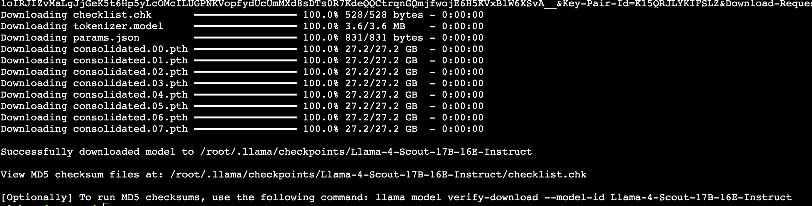
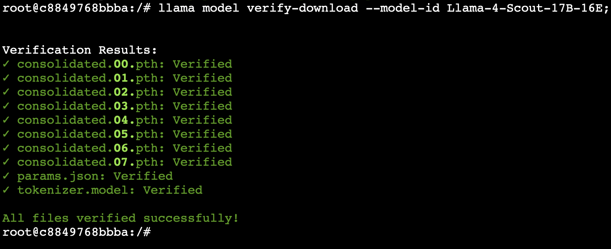
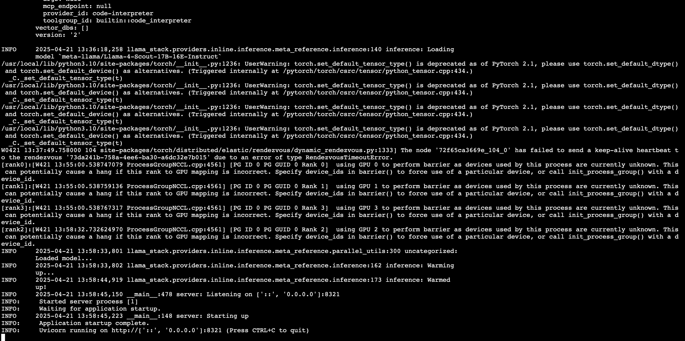
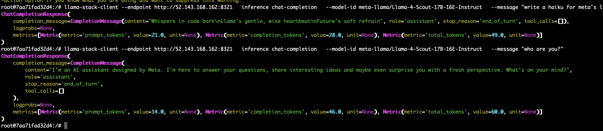

# Running Llama Scout using a Cloud VM

When a task is too resource consuming for running on your laptop, you can hire a VM in the cloud. There might be a few options.

## Using Azure Cloud Shell

Before starting, make sure that in your Azure subscription you have at least 96 Cores quota available for `Standard NCADS_A100_v4 Family vCPUs` (`StandardNCADSA100v4Family`). This itself can take awhile.

```bash
# Create ~/.ssh directory if it does not exist
mkdir -p ~/.ssh

# Create an SSH key pair
ssh-keygen -m PEM -t rsa -b 4096 -f ~/.ssh/id_rsa.pem
cat ~/.ssh/id_rsa.pem.pub

az feature register --name UseStandardSecurityType --namespace Microsoft.Compute

az group create --name ai-labs-01 --location francecentral

az vm delete \
  --resource-group ai-labs-01 \
  --name small_basic \
  -y;
start_time=$(date +%s.%N);  # Capture start time
az vm create \
  --resource-group ai-labs-01 \
  --name small_basic \
  --image Microsoft-DSVM:Ubuntu-HPC:2204:22.04.2024102301 \
  --size Standard_D2s_v3 \
  --security-type Standard \
  --os-disk-size-gb 320 \
  --os-disk-delete-option Delete \
  --admin-username admin98475897 \
  --ssh-key-values ~/.ssh/id_rsa.pem.pub;
end_time=$(date +%s.%N);  # Capture end time
elapsed_time=$(awk "BEGIN {print $end_time - $start_time}");
echo "Elapsed time: $elapsed_time seconds";
# 65-85 sec

vm_ip_address=$(az vm list-ip-addresses --resource-group ai-labs-01 --name small_basic --query [].virtualMachine.network.publicIpAddresses[].ipAddress -o tsv);
ssh-keygen -R $vm_ip_address;
az ssh vm --resource-group ai-labs-01 --name small_basic --local-user admin98475897 --private-key-file ~/.ssh/id_rsa.pem "sudo usermod -aG docker admin98475897";
```

confirm `yes`
then run

```bash
az ssh vm --resource-group ai-labs-01 --name small_basic --local-user admin98475897 --private-key-file ~/.ssh/id_rsa.pem '
docker run --rm -v /data/.llama:/root/.llama python:3.13.3-bookworm /bin/bash -c "
meta_url=\"https://llama4.llamameta.net/*?Policy=eyJTdGF0ZW1lbnQiOlt7InVuaXF1ZV9oYXNoIjoiaWJwOGJ6OGVxeWd2dmYwZmIybXk0dng5IiwiUmVzb3VyY2UiOiJodHRwczpcL1wvbGxhbWE0LmxsYW1hbWV0YS5uZXRcLyoiLCJDb25kaXRpb24iOnsiRGF0ZUxlc3NUaGFuIjp7IkFXUzpFcG9jaFRpbWUiOjE3NDQ1NjcyNTV9fX1dfQ__&Signature=f81YaavpdkkwMMX2SPWshbAoEutTYENOXHUmZEQXIEgCWJVO%7EWEb7r-1sGTsfmDctHitpEqjdtElHiPlfa7a2MlNUQNU9WaBBObKRkP%7EZoJWSaKzE68s7xxKUyWNRBWgB7VaIHDCGpRxTsHBnexE-8N5XvNfx1xKcZQO9UCJ6gbtFVFTGpGUZqhIU6ACmp7as-OytWJrda0e99X7koU1lvsdgYMCB61aClU7kgpd0jATO2BavOZHN9wkGLhYloIRJIZvMaLgJjGeK5t6Hp5yLcOMcILUGPNKVopfydUcUmMXd8sDTs0R7KdeQQCtrqnGQmjfwojE6H5KVxBlW6XSvA__&Key-Pair-Id=K15QRJLYKIFSLZ&Download-Request-ID=665474946103269\";
pip install llama-stack;
llama model download --model-id Llama-4-Scout-17B-16E-Instruct --meta-url \"\$meta_url\";
"
'
```



Example of the full output: [Page](model-download.out)

This can take 1-2 hours. If the session got interrupted, you can just rerun the previous command. If you want to do downloading in a more predicted way, use the following commands:

```bash
az ssh vm --resource-group ai-labs-01 --name small_basic --local-user admin98475897 --private-key-file ~/.ssh/id_rsa.pem
```

Then in the VM ssh session run:

```bash
docker run -it --rm -v /data/.llama:/root/.llama python:3.13.3-bookworm /bin/bash
````

Then run the following commands in the container:

```bash
meta_url="https://llama4.llamameta.net/*?Policy=eyJTdGF0ZW1lbnQiOlt7InVuaXF1ZV9oYXNoIjoiaWJwOGJ6OGVxeWd2dmYwZmIybXk0dng5IiwiUmVzb3VyY2UiOiJodHRwczpcL1wvbGxhbWE0LmxsYW1hbWV0YS5uZXRcLyoiLCJDb25kaXRpb24iOnsiRGF0ZUxlc3NUaGFuIjp7IkFXUzpFcG9jaFRpbWUiOjE3NDQ1NjcyNTV9fX1dfQ__&Signature=f81YaavpdkkwMMX2SPWshbAoEutTYENOXHUmZEQXIEgCWJVO%7EWEb7r-1sGTsfmDctHitpEqjdtElHiPlfa7a2MlNUQNU9WaBBObKRkP%7EZoJWSaKzE68s7xxKUyWNRBWgB7VaIHDCGpRxTsHBnexE-8N5XvNfx1xKcZQO9UCJ6gbtFVFTGpGUZqhIU6ACmp7as-OytWJrda0e99X7koU1lvsdgYMCB61aClU7kgpd0jATO2BavOZHN9wkGLhYloIRJIZvMaLgJjGeK5t6Hp5yLcOMcILUGPNKVopfydUcUmMXd8sDTs0R7KdeQQCtrqnGQmjfwojE6H5KVxBlW6XSvA__&Key-Pair-Id=K15QRJLYKIFSLZ&Download-Request-ID=665474946103269";
pip install llama-stack;
llama model download --model-id Llama-4-Scout-17B-16E-Instruct --meta-url "$meta_url";
llama model verify-download --model-id Llama-4-Scout-17B-16E-Instruct;
```



exit

exit

taking image and deleting the VM:

```bash
start_time=$(date +%s.%N);  # Capture start time
az ssh vm --resource-group ai-labs-01 --name small_basic --local-user admin98475897 --private-key-file ~/.ssh/id_rsa.pem "sudo waagent -deprovision+user -force";
az vm deallocate --resource-group ai-labs-01 --name small_basic;
az vm generalize --resource-group ai-labs-01 --name small_basic;
az image create \
  --resource-group ai-labs-01 \
  --name small_basic_00 \
  --source small_basic \
  --os-type Linux \
  --hyper-v-generation V2;
az vm delete \
  --resource-group ai-labs-01 \
  --name small_basic \
  -y;
end_time=$(date +%s.%N);  # Capture end time
elapsed_time=$(awk "BEGIN {print $end_time - $start_time}");
echo "Elapsed time: $elapsed_time seconds";
# 105-110 sec
```

```bash
az vm delete \
  --resource-group ai-labs-01 \
  --name medium_nvidia \
  -y;
start_time=$(date +%s.%N);  # Capture start time
image_id=$(az resource show --resource-group ai-labs-01 --name small_basic_00 --resource-type Microsoft.Compute/images --query id -o tsv);
az vm create \
  --resource-group ai-labs-01 \
  --name medium_nvidia \
  --image $image_id \
  --size Standard_NC24ads_A100_v4 \
  --security-type Standard \
  --os-disk-delete-option Delete \
  --admin-username admin98475897 \
  --ssh-key-values ~/.ssh/id_rsa.pem.pub;
end_time=$(date +%s.%N);  # Capture end time
elapsed_time=$(awk "BEGIN {print $end_time - $start_time}");
echo "Elapsed time: $elapsed_time seconds";
# 65-85 sec

vm_ip_address=$(az vm list-ip-addresses --resource-group ai-labs-01 --name medium_nvidia --query [].virtualMachine.network.publicIpAddresses[].ipAddress -o tsv);
ssh-keygen -R $vm_ip_address;
az ssh vm --resource-group ai-labs-01 --name medium_nvidia --local-user admin98475897 --private-key-file ~/.ssh/id_rsa.pem "echo test";
```

confirm `yes`
then run

```bash
start_time=$(date +%s.%N);  # Capture start time
az ssh vm --resource-group ai-labs-01 --name medium_nvidia --local-user admin98475897 --private-key-file ~/.ssh/id_rsa.pem "sudo usermod -aG docker admin98475897";
az ssh vm --resource-group ai-labs-01 --name medium_nvidia --local-user admin98475897 --private-key-file ~/.ssh/id_rsa.pem docker pull llamastack/distribution-meta-reference-gpu:0.2.5;
az ssh vm --resource-group ai-labs-01 --name medium_nvidia --local-user admin98475897 --private-key-file ~/.ssh/id_rsa.pem "docker run --rm --gpus all nvcr.io/nvidia/k8s/cuda-sample:nbody nbody -benchmark";
end_time=$(date +%s.%N);  # Capture end time
elapsed_time=$(awk "BEGIN {print $end_time - $start_time}");
echo "Elapsed time: $elapsed_time seconds";
# 150-160 sec
```

expected output:

```
> Compute 8.0 CUDA device: [NVIDIA A100 80GB PCIe]
110592 bodies, total time for 10 iterations: 178.296 ms
= 685.972 billion interactions per second
= 13719.437 single-precision GFLOP/s at 20 flops per interaction
```

taking image and deleting the VM:

```bash
start_time=$(date +%s.%N);  # Capture start time
az ssh vm --resource-group ai-labs-01 --name medium_nvidia --local-user admin98475897 --private-key-file ~/.ssh/id_rsa.pem "sudo waagent -deprovision+user -force";
az vm deallocate --resource-group ai-labs-01 --name medium_nvidia;
az vm generalize --resource-group ai-labs-01 --name medium_nvidia;
az image create \
  --resource-group ai-labs-01 \
  --name medium_nvidia_00 \
  --source medium_nvidia \
  --os-type Linux \
  --hyper-v-generation V2;
az vm delete \
  --resource-group ai-labs-01 \
  --name medium_nvidia \
  -y;
end_time=$(date +%s.%N);  # Capture end time
elapsed_time=$(awk "BEGIN {print $end_time - $start_time}");
echo "Elapsed time: $elapsed_time seconds";
# 105-110 sec
```

```bash
start_time=$(date +%s.%N);  # Capture start time
image_id=$(az resource show --resource-group ai-labs-01 --name medium_nvidia_00 --resource-type Microsoft.Compute/images --query id -o tsv);
az vm create \
  --resource-group ai-labs-01 \
  --name medium_nvidia \
  --image $image_id \
  --size Standard_NC96ads_A100_v4 \
  --security-type Standard \
  --os-disk-delete-option Delete \
  --admin-username admin98475897 \
  --ssh-key-values ~/.ssh/id_rsa.pem.pub;
az network nsg rule create \
  --resource-group ai-labs-01 \
  --nsg-name medium_nvidiaNSG \
  --name AllowLlamaServer \
  --protocol tcp \
  --priority 1001 \
  --destination-port-range 8321 \
  --access allow;
end_time=$(date +%s.%N);  # Capture end time
elapsed_time=$(awk "BEGIN {print $end_time - $start_time}");
echo "Elapsed time: $elapsed_time seconds";
# 65-165 sec

vm_ip_address=$(az vm list-ip-addresses --resource-group ai-labs-01 --name medium_nvidia --query [].virtualMachine.network.publicIpAddresses[].ipAddress -o tsv);
ssh-keygen -R $vm_ip_address;
az ssh vm --resource-group ai-labs-01 --name medium_nvidia --local-user admin98475897 --private-key-file ~/.ssh/id_rsa.pem "sudo usermod -aG docker admin98475897";
```

confirm `yes`
then run

```bash
az ssh vm --resource-group ai-labs-01 --name medium_nvidia --local-user admin98475897 --private-key-file ~/.ssh/id_rsa.pem "
docker run --rm --gpus all nvidia/cuda:12.9.0-runtime-ubuntu24.04 nvidia-smi
"

az ssh vm --resource-group ai-labs-01 --name medium_nvidia --local-user admin98475897 --private-key-file ~/.ssh/id_rsa.pem "
docker run --rm --gpus all nvcr.io/nvidia/k8s/cuda-sample:nbody nbody -benchmark
"

az ssh vm --resource-group ai-labs-01 --name medium_nvidia --local-user admin98475897 --private-key-file ~/.ssh/id_rsa.pem "
docker run \
  --rm \
  -p 8321:8321 \
  -v /data/.llama:/root/.llama \
  --gpus '\"device=0,1,2,3\"' \
  --shm-size=16g \
  --env INFERENCE_MODEL=meta-llama/Llama-4-Scout-17B-16E-Instruct \
  --env MODEL_PARALLEL_SIZE=4 \
  --env LLAMA_STACK_LOG=debug \
  llamastack/distribution-meta-reference-gpu:0.2.5;
"
```

After approximately 30 minutes you should expect to see the following output:



Example of the full output: [Page](model-run-01.out)

Now show the IP address of the VM:

```bash
az vm list-ip-addresses --resource-group ai-labs-01 --name medium_nvidia --query [].virtualMachine.network.publicIpAddresses[].ipAddress -o tsv
```

Then run on the laptop, after replacing the IP address with the one of your VM:

```bash
curl http://52.143.168.162:8321/v1/health

curl http://52.143.168.162:8321/v1/models

curl -X POST \
  http://52.143.168.162:8321/v1/inference/chat-completion \
  -H 'accept: application/json' \
  -H 'Content-Type: application/json' \
  -d '{
        "model_id": "meta-llama/Llama-4-Scout-17B-16E-Instruct",
        "messages": [
          {
            "role": "user",
            "content": [
              {
                "type": "text",
                "text": "Which number is bigger: 99 or 5 in power of 99?"
              }
            ]
          }
        ]
      }'
```

Start a container locally:

```bash
docker run -it --rm python:3.13.3-bookworm /bin/bash
````

Run in the container, after replacing the IP address with the one of your VM:

```bash
pip install llama-stack-client==0.2.2;
export LLAMA_STACK_CLIENT_LOG=debug;
llama-stack-client --endpoint http://52.143.168.162:8321 \
  inference chat-completion \
  --model-id meta-llama/Llama-4-Scout-17B-16E-Instruct \
  --message "What is the difference between ollama and llama-stack?"
```


